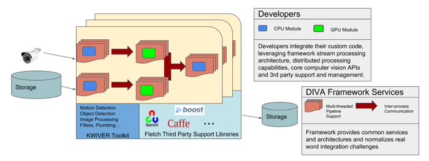

.. image:: doc/DIVA_Final_Logo_72dpi.png
   :alt: DIVA

Deep Intermodal Video Analytics (DIVA) Framework
================================================

The DIVA Framework is a software framework designed to provide an architecutre and a set of software modules
which will facilitate the development of DIVA analytics.
From the `DIVA Website <https://www.iarpa.gov/index.php/research-programs/diva>`_:

  	The DIVA program seeks to develop robust automatic activity detection for a
	multi-camera streaming video environment. Activities will be enriched by person
	and object detection. DIVA will address activity detection for both forensic
	applications and for real-time alerting.

The DIVA Framework is based on `KWIVER <http://www.kwiver.org>`_ and open source framework designed for
building complex computer vision systems.  Some of the features of the framework are:

- A video processing pipeline architecture designed to support multi-threaded and distributed processing system designs.
- A rich and growing collection of computer vision processing modules
- A dynamic designed which supports a wide range of third party libraries and frameworks including OpenCV,
  deep learning frameworks such as Caffe and Darknet as well as many other libraries helpful for developing
  complete computer vision systems.  See KWIVER's third party management repository
  `Fletch <https://github.com/Kitware/fletch>`_ for more details.

Developers use the framework by implementing new algrothim implementations, processes or core
datatypes.    These become plugins to the the framework and can then be combined with other framework modules to build out fully elaborated DIVA analytics systems.

For more information visit the framework's `documentation site <http://kwiver-diva.readthedocs.io/en/latest/>`_

DIVA Baseline Implementations
-----------------------------

As part of the DIVA effort, Kitware has implemented several current state of the art algorithms that address the DIVA problem using the DIVA framework:

The R-C3D baseline implmentation can be found at:

   `https://gitlab.kitware.com/kwiver/R-C3D/tree/kitware/master <https://gitlab.kitware.com/kwiver/R-C3D/tree/kitware/master>`_

And the ACtion Tubelet Detector can be found at:

   `https://gitlab.kitware.com/kwiver/act_detector/tree/kitware/master <https://gitlab.kitware.com/kwiver/act_detector/tree/kitware/master>`_

.. Note::
   To see Kitware's DIVA Framework based implementation of these baseline algorithms, be sure to checkout the ``kitware/master`` branch in these repositories.

Both of the baseline algorithms implemenations come with `Docker <https://www.docker.com>`_ `Dockerfiles`.  See the ``docker`` directory in the R-C3D baseline and
the ``act-docker`` director in the ACT baseline.  These dockerfiles should be built and run with the `nvidia-docker <https://github.com/NVIDIA/nvidia-docker>`_
flavor of Docker.

Building DIVA
===============

Dependencies
------------
DIVA requires, at a minimum, `Git <https://git-scm.com/>`_, `CMake <https://cmake.org/>`_, a C++ compiler, and a `Python 2.7 environment <https://python.org>`_.

The DIVA Framework repository is structured as a CMake "super-build" which fetches, configures
and builds both KWIVER and Fletch along with the DIVA Framework specific code.  While most of the framework's dependencies are carried by Fletch, there may be some preparation of your development
system required before you can successfully build the framework.

On Ubuntu systems, for example you'll want to make sure the following packages are installed on your system:

.. code-block :: bash

 # The following example uses the Ubuntu apt-get package manager
 # These command may differ depending on your Linux flavor and package manager
 sudo apt-get install build-essential libgl1-mesa-dev
 sudo apt-get install libexpat1-dev
 sudo apt-get install libgtk2.0-dev
 sudo apt-get install liblapack-dev
 sudo apt-get install python2.7-dev

Running CMake
-------------

We recommend building DIVA out of its source directory to prevent mixing
source files with compiled products.  Create a build directory in parallel
with the DIVA source directory for each desired configuration. For example :

========================== ===================================================================
``\DIVA\src``               contains the code from the git repository
``\DIVA\build\release``     contains the built files for the release configuration
``\DIVA\build\debug``       contains the built files for the debug configuration
========================== ===================================================================

Basic CMake generation via command line
~~~~~~~~~~~~~~~~~~~~~~~~~~~~~~~~~~~~~~~

The following example will pull and build Fletch and KWIVER along with the DIVA code base.
It assumes that you are ``\DIVA\build\release`` directory.  What follows are the commands
to configure and build the DIVA framework in several common configurations:

To build a "release" version of DIVA::

    $ cmake ../../src -DCMAKE_BUILD_TYPE=Release
    $ make -j 4

.. Note::
   The `-j 4` argument starts a build process with 4 threads.  You'll want to choose a value consistent with the number of cores you have,
   typically one or two more if you have a dedicated machine

To build with CUDA enabled::

    $ cmake ../../src -DCMAKE_BUILD_TYPE=Release -DDIVA_BUILD_WITH_CUDA=ON
    $ make -j 4

To build with CUDNN enabled::

    $ cmake ../../src -DCMAKE_BUILD_TYPE=Release -DDIVA_BUILD_WITH_CUDA=ON -DDIVA_BUILD_WITH_CUDNN=ON
    $ make -j 4

.. Note::
   If your CUDA and or CUDNN installations are not in the default location, you may need to specifiy their
   location with the CUDA_TOOLKIT_ROOT_DIR and CUDNN_TOOLKIT_ROOT_DIR variables

Next Steps
==========

For more details on building and using the DIVA framework, please see the
`DIVA Framework Documentation <https://kwiver-diva.readthedocs.io/en/latest/introduction.html>`_

For general build or code issues, please join the `kwiver-users
<http://public.kitware.com/mailman/listinfo/kwiver-users>`_ mailing list. For discussions of the DIVA API, please contact diva-te <at> kitware.com to join the diva-API mailing list.

For announcements about KWIVER in general, please join the
`kwiver-announce <http://public.kitware.com/mailman/listinfo/kwiver-announce>`_
mailing list.
