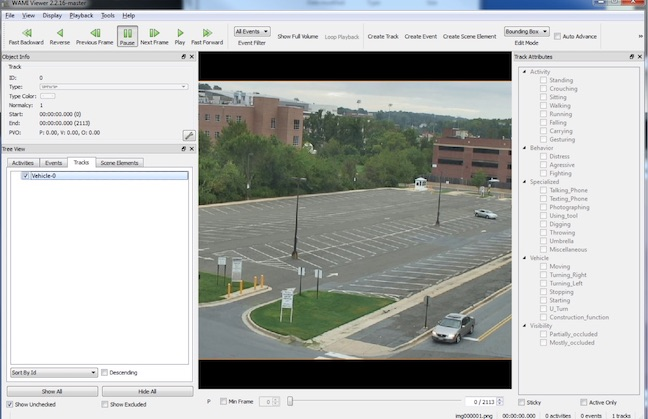

ViViA Annotation Tools for the DIVA Framework
==============================================

Kitware has developed annotation tools based on the `ViViA <https://github.com/Kitware/vivia>`_  project for use in producing the datasets for use with the DIVA framework.  These tools produce the native :doc:`KPF`</kpf>` format used by the DIVA project and supported by the DIVA Framework.

The annotation tool (built for Ubuntu Linux) and some supporting files can be found at these links:

* `vpview.ubuntu.14mar2019.tgz <https://data.kitware.com/api/v1/item/5c8a75a88d777f072b980918/download>`_ The annotation tool built for Ubuntu Linux
* `vpViewer-User-Guide.14mar19.pdf <https://data.kitware.com/api/v1/item/5c8a75ff8d777f072b98096e/download>`_ The annotation tool user manual
* `WAMI Viewer.ini <https://data.kitware.com/api/v1/item/5c8a75e18d777f072b980957/download>`_ A configuration file to use with the tool
* `VIRAT_S_000000.sample-data.tgz <https://data.kitware.com/api/v1/item/5c8a75d78d777f072b98094b/download>`_ A sample data to use with the tool

