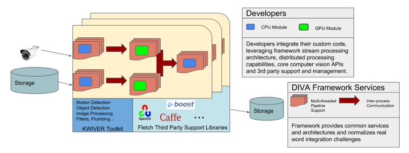

.. image:: _images/DIVA_Final_Logo_72dpi.png
   :alt: DIVA

Introduction
============

DIVA is a framework for deploying video analytics in a multi-camera
environment, funded by `IARPA`_ and licensed under `BSD license`_.

From the `DIVA Website <https://www.iarpa.gov/index.php/research-programs/diva>`_:

  	The DIVA program seeks to develop robust automatic activity detection for a
	multi-camera streaming video environment. Activities will be enriched by person
	and object detection. DIVA will address activity detection for both forensic
	applications and for real-time alerting.

DIVA is being developed as an open source, end to end system for incorporating
state of the art activity detection algorithms into multi-camera streaming video
environments. These algorithms include both traditional and deep learning approaches
for activity detection. Since almost all these algorithms are designed to work in
offline single stream environment, porting them to online multi-stream environment requires
significant effort on part of the researchers and developers. DIVA
seeks to reduce this effort and streamline the process by providing an open standard
for reasoning across multiple video streams obtained from geographically and
topologically diverse environment.

The DIVA Framework is based on `KWIVER <http://www.kwiver.org>`_ an open source framework designed for
building complex computer vision systems.  Some of the features of the framework are:

- A video processing pipeline architecture designed to support multi-threaded and distributed processing system designs.
- A rich and growing collection of computer vision processing modules
- A dynamic design which supports a wide range of third party libraries and frameworks including OpenCV,
  deep learning frameworks such as Caffe and Darknet as well as many other libraries helpful for developing
  complete computer vision systems.  See KWIVER's third party management repository
  `Fletch <https://github.com/Kitware/fletch>`_ for more details.

Developers use the framework by implementing new algrothim implementations, processes or core
datatypes.    These become plugins to the the framework and can then be combined with other framework modules to build out fully elaborated DIVA analytics systems.

The process of integrating a DIVA activity detector into the DIVA framework primarily
consists of creating a plugin or collection of plugins chiefly be implementing a configuration
and frame processing function and combining them with other provided processes (such as I/O
processes) into sophisticated processing pipelines.

Features
########

As noted, the DIVA framework is based on `KWIVER <http://www.kwiver.org>_`, leveraging existing algorithms
and infrastructure.  The major features of KWIVER that are used by DIVA include

1. Abstract Algorithms: KWIVER separates the definition and implementation of standard
   algorithms. This allows the user to have multiple implementation of an algorithm that
   can be selected at runtime as a configuration parameter. The definition and implementations
   are extensible in c++ which allows user to integrate their algorithms at different levels
   of abstraction in the framework. Out of the box, KWIVER supports numerous algorithm
   definition and implementation that can be found in `algorithms`_ and `arrows`_ directory.
2. Data Types: Along with the standard types, KWIVER provides a set of `complex data types`_
   designed for the computer vision algorithms, e.g. BoundingBox. These types provide
   a standard input/output interface for the algorithms to pass data. Thereby
   allowing users to chain algorithms and exchange data between them.
3. Multi-threaded reconfigurable pipelines: The chaining mechanism in KWIVER are
   called pipelines. A pipeline defines the relationship of the components of
   a system in text format or programmatically. The pipelines are agnostic
   to the language in which the process are written and can use any and all the
   processes that KWIVER and DIVA provides. By default pipelines are multi-threaded
   and can be paired with ZeroMQ to distribute the components of a pipeline
   across the network.
4. Interprocess communication: With deep networks becoming state of the art for
   almost all computer vision task, GPU footprint of the components of a large
   system is a major concern. For example, creating an instance of activity detector
   with `ACT`_ to localize activities and `Faster RCNN`_ to localize participants
   in the activity would require ~15Gb of GPU memory and would rely on multiple
   GPUs. To manage the communication between the algorithms and synchronizing the
   input/outputs, KWIVER uses `ZeroMQ`_'s. This allows the user to distribute
   the components of their system to any networked system with the resource to
   run it.

Resources
#########

* `DIVA Framework Github Repository <https://github.com/Kitware/DIVA>`_ This is the main DIVA Framework site, all development of the framework happens here.
* `DIVA Framework Issue Tracker <https://github.com/Kitware/DIVA/issues>`_  Submit any bug reports or feature requests for the framework here.
* `DIVA Framework Main Documentation Page <https://kwiver-diva.readthedocs.io/en/latest/>`_ The source for the framework documentation is maintained in the Github repository using `Sphinx <http://www.sphinx-doc.org/en/master/>`_  A built version is maintained on `ReadTheDocs <https://readthedocs.org/>`_.   A good place to get started in the documentation, after reading the `Introduction <https://kwiver-diva.readthedocs.io/en/latest/introduction.html>`_ is the `UseCase <https://kwiver-diva.readthedocs.io/en/latest/usecases.html>`_ section which will walk you though a number of typical use cases with the framework.
* KITWARE has implemented two "baseline" activity recognition algorithms in terms of the Framework:

  + `R-C3D <https://gitlab.kitware.com/kwiver/R-C3D/tree/kitware/master>`_
  + `ACT <https://gitlab.kitware.com/kwiver/act_detector/tree/kitware/master>`_

What's Next
###########
* :doc:`Build DIVA </install>`
* `Learn about KWIVER <KWIVER_>`_
* :doc:`Checkout Algorithms in DIVA </processes>`
* :doc:`Integrate Your Algorithm in the framework </tutorials>`
* :doc:`Contents <index>`

.. Appendix 1: links

.. _IARPA: https://www.iarpa.gov/index.php/research-programs/diva
.. _Build DIVA: https://github.com/Kitware/DIVA#building-diva
.. _KWIVER: https://github.com/Kitware/kwiver
.. _plugable modules: https://github.com/Kitware/kwiver/tree/master/sprokit/processes
.. _pipeline: https://github.com/Kitware/kwiver/tree/master/examples/pipelines
.. _BSD license: https://github.com/Kitware/DIVA/blob/master/LICENSE.txt
.. _arrows: https://github.com/Kitware/kwiver/tree/master/arrows
.. _algorithms: https://github.com/Kitware/kwiver/tree/master/vital/algo
.. _complex data types: https://github.com/Kitware/kwiver/blob/master/doc/manuals/vital/architecture.rst
.. _ACT: https://thoth.inrialpes.fr/src/ACTdetector/
.. _Faster RCNN: https://github.com/rbgirshick/py-faster-rcnn
.. _ZeroMQ: http://zeromq.org/
.. _Extending Vital Types: https://github.com/Kitware/kwiver/tree/master/doc/manuals/vital
.. _config: https://github.com/Kitware/kwiver/blob/master/doc/manuals/vital/configuration.rst
.. _Extending KWIVER: https://github.com/Kitware/kwiver/blob/master/doc/manuals/extentions.rst
.. _Sprokit: https://github.com/Kitware/kwiver/blob/master/doc/manuals/sprokit/getting-started.rst
.. _pipeline_runner: https://github.com/Kitware/kwiver/blob/master/doc/manuals/tools/pipeline_runner.rst
