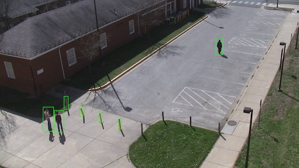

Use Cases
=========

This section of the DIVA Framework documentation will work users through typical use cases that they are likely to encounter as they work on DIVA releated tasks.

Working with DIVA Data Sets
###########################

The first DIVA task you'll likely want to accomplish is to examine the DIVA data, particulary the provided annotations.  The DIVA framework provides a number of tools that facilitate this.  This section will discuss how to use them.

Simple Annotations
------------------

The central processing mechanism is the Sprokit pipeline.  Pipelines are dynamically configurable using `.pipe` files that allow the connection of a number of procressing nodes to accomplish a specific task.  In this case, we'll create a pipeline that reads a video file and set of annotaitons, draws teh annottaion bounding boxes on the images and makes them available for review.

To do this, you'll need to build the DIVA framework.  You'll also need the `pipeline_runner` command which should be in your `PATH` if you source `<diva framework build directory>/setup_DIVA.sh` after you've built the DIVA framework.

A `.pipe` file that will accomplish this task can be found at `view_diva_annotations.pipe`.  To familiarize you with the use of pipelines and to introduce some of the basic capabilities of the DIVA framework we'll examine that pipeline file in detail here.

The first element in the pipeline opens and reads the video data::

  process input
  :: video_input
  video_filename      = /Users/kfieldho/Projects/Kitware/Vision/Data/DIVA/V1/VIRAT_S_000000.mp4
  frame_time         = .3333
  video_reader:type  = vidl_ffmpeg

What this says is that we're creating a process in our pipeline called `input` which is of type `video_input`.  We set a number of configuration parameters for this process the most important of which is the `video_filename` which should provide the full path name of the video file you want to visualize.

We'll create another process that reads the appropriate annotations.  The DIVA program provides annotations in two formats.  The first is a JSON format that is used by NIST as they run their evalautions.  The second is a `KPF` format used as a native format with the KWIVER framework on which DIVA framework is based which in some cases carries more information than the JSON format which may be useful.  For now we will concern ourselves with the KPF format::

   process annotations
     :: detected_object_input
     file_name = /Users/kfieldho/Projects/Kitware/Vision/Data/DIVA/V1/VIRAT_S_000000.geom.yml
     reader:type = kpf_input

We're creating a `detected_object_input` process called `annoations`. The `reader:type` configuration parameter tells Sprokit to load the `kpf_input` implementation of `detected_object_input`. Perhaps the most important configuration parameter is `file_name` which specifies the input file.  In this case we're going to use the "geom" KPF file provided with the DIVA dataset corresponding with the video that we've selected.  (KPF is storage agnostic, YAML is used for the delivery of KPF files related to the DIVA program).  The "geom" file carries the bounding boxes for the annotations, which we'll be visualizing with the next section of the `.pipe` file::

   process draw_annotations
     :: draw_detected_object_set
     :draw_algo:type ocv
     :draw_algo:ocv:default_color 0 250 0
     :draw_algo:ocv:default_line_thickness 2
     :draw_algo:ocv:draw_text false

   connect from input.image to draw_annotations.image
   connect from annotations.detected_object_set to draw_annotations.detected_object_set

Here're we're creating a `draw_detected_object_set` process called `draw_annotations`.  To configure this process, we'll explore further some of the capabilities of the Sprokit/KWIVER pipeline system.  First, we'll introduce a new command `plugin_explorer` that will help us learn about the plugins available in the system.  First, we'll get the documenation for `draw_detected_object_set` by issuing the command `plugin_explorer --process draw_detected_object_set --detail`::

  Process type: draw_detected_object_set
  Description:       Draws border around detected objects in the set using the selected
      algorithm.

      This process is a wrapper around a draw_detected_object_set algorithm.

    Properties: _no_reentrant

    -- Configuration --
    Name       : draw_algo
    Default    :
    Description:       Name of drawing algorithm config block./n/nSpecify an implementation of
      the draw_detected_object_set algorithm as draw_algo:type = <type>
    Tunable    : no

  -- Input ports --
    Name       : detected_object_set
    Data type  : kwiver:detected_object_set
    Flags      : _required
    Description: Set of detected objects.

    Name       : image
    Data type  : kwiver:image
    Flags      : _required
    Description: Single frame image.

  -- Output ports --
    Name       : image
    Data type  : kwiver:image
    Flags      :
    Description: Single frame image.


First, this output tells us that there's a configuration setting called `draw_algo` that should specify an implemenation of `draw_detected_object_set` as `draw_algo:type`.  We'll use plugin_explorer to learn more about these algorithms by issueing the command `plugin_explorer --algorithm draw_detected_object_set --detail`::

   Plugins that implement type "draw_detected_object_set"
   ---------------------
   Info on algorithm type "draw_detected_object_set" implementation "ocv"
     Plugin name: ocv
	 Draw bounding box around detected objects on supplied image.
       -- Configuration --
       "alpha_blend_prob" = "true"
       Description:       If true, those who are less likely will be more transparent.

       "clip_box_to_image" = "false"
       Description:       If this option is set to true, the bounding box is clipped to the image
	 bounds.

       "custom_class_color" = ""
       Description:       List of class/thickness/color seperated by semicolon. For example:
	 person/3/255 0 0;car/2/0 255 0. Color is in RGB.

       "default_color" = "0 0 255"
       Description:       The default color for a class (RGB).

       "default_line_thickness" = "1"
       Description:       The default line thickness, in pixels.

       "draw_text" = "true"
       Description:       If this option is set to true, the class name is drawn next to the
	 detection.

       "select_classes" = "*ALL*"
       Description:       List of classes to display, separated by a semicolon. For example:
	 person;car;clam

       "text_scale" = "0.4"
       Description:       Scaling for the text label. Font scale factor that is multiplied by the
	 font-specific base size.

       "text_thickness" = "1"
       Description:       Thickness of the lines used to draw a text.

       "threshold" = "-1"
       Description:       min threshold for output (float). Detections with confidence values below
	 this value are not drawn.

In this case there is only one algorithm plugin, `ocv` that applies.  The output provides the list of configuration options that we can select.  In the example pipeline, we choose to set `default_color`, `default_line_thickness` and `draw_text`.

At this point, we've defined most of the processes we need in our pipeline.  Now we must connect them together in order for the pipeline to accomplish something.  Looking back at the process documentation for `draw_detected_object_set` we see a listing of the input ports for the process, specifically an `image` port and a `detected_object_set`.  We can use `plugin_explorer` to examine the `detected_object_input` process to see that it has an output port of `detected_object_set`.  Given this we can use the `connect` command in the pipeline to connect the `detected_object_set` output port of `detected_object_input` to the `detected_object_set` input port of `draw_detected_object_set`.  Similarly, we can connect the `image` output port of the `video_input` process to the `image` input port of `draw_detected_object_set`.

Finally, we'll want to see the result of the annotated images. We'll create an `image_writer` process and connect the `image` output of the `draw_detected_object_set` process to its corresponding `image` input port.    We configure the `image_writer` to write its output to the `OUTPUT` directory in our current working directory, naming each image with an "image" prefix and a zero padded frame number.  by using the ".jpg" extension, we will get JPEG output images.  We could have used ".png" for PNG images.

Running the pipeline is straightforward::

	pipeline_runner --pipeline view_diva_annotations.pipe

We can then review the resulting images with our favorite image viewer:

.. _usecaseiannotatediamgesimple:

   *Simple Frame Annotation of DIVA Data Set*

Integrating an Activity Detector
#################################

To create a pluggable modules that the DIVA framework can detect/use during deployment, you will 
use the Sprokit ``process`` interface. This ensures consistency in the data flow, allowing
different ``process`` nodes to interact with each other. An algorithm can be expressed 
as a single process or a pipeline of processes based on developer's requirements. Currently, 
the DIVA framework supports Python and C++ processes that are created by inheriting 
``KWIVERProcess`` and  ``sprokit::process`` respectively. Implementing the process interface
can be divided into three components: 

    1. Defining Ports: The data flow amongst processes is managed using 
       ``ports``. The input ``ports`` indicate input for the algorithm. Similarly,
       the output ``ports`` indicate the output of the algorithm. 
       For example,  the DIVA baseline algorithm ``RC3DDetector`` declares ``image``, ``timestamp`` and ``file_name`` as 
       input ports and ``detected_object_set`` as its only  
       output port. These ``ports`` use  `Vital types <complex data types_>`_ to transmit
       complex data structures designed for vision based applications. 
       Additionally, if these types do not cover an algorithms input/output requirement,
       additional Vital types can be created. Refer to the tutorial on `Extending Vital Types`_   
       for additional information.

    2. Adding Configuration Parameters: `Configuration parameter <config_>`_ are 
       used to specify algorithm parameters. These parameters are declared by a 
       process and can be specified when the process is added to a pipeline or 
       at runtime.  In addition to traditional configuration parameters, processes
       frequently make use of KWIVER's ``AbstractAlgorithm`` capability to allow a
       configuration parameter to select among several implementations of the processes
       algorithm.  Refer to the tutorial on :doc:`Tight Integration </tutorials>` and 
       `Extending KWIVER`_ for details.

    3. Overriding ``_configure`` and ``_step`` functions: The ``_configure`` function
       is called process instantiation and is responsible for retrieving and applying
       configuration parameters.  The ``_step`` function is called for each processing step
       (typically for each frame of video input) and retrieves data from the process input
       ports, manipulates and transforms that data in some way and puts the resulting data
       on its output port for processing by down stream nodes in the pipeline.

For more details about sprokit processes, refer to :doc:`Processes </processes>`.

The data flow amongst the modules is defined as a `pipeline`_ (actually a directed
acyclic graph of processing nodes). The pipeline
declares the process present, provides configuration parameters
for every process and connects the ports for the process. The framework supports
expressing pipelines using plain text file or programmatically in Python or C++.
Refer to :doc:`Pipelines </pipelines>` for more additional information.

To execute a plain text pipeline file, the DIVA framework uses an executable
provided by KWIVER, ``pipeline_runner``.  The executable accepts a ``.pipe`` file
as input along with any configuration parameter adjustments and runs the pipeline::

 pipeline_runner -p test.pipe --set test_process:configuration_name=test

The usage information for pipeline_runner is documented in detail `here <pipeline_runner>`_.

